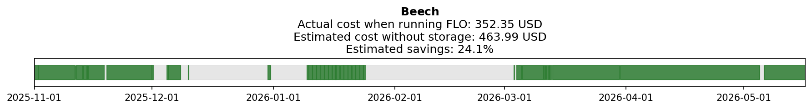
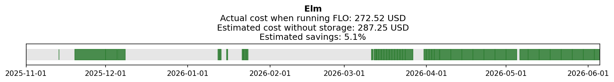
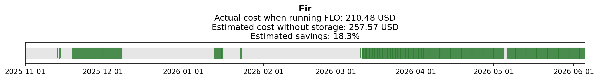
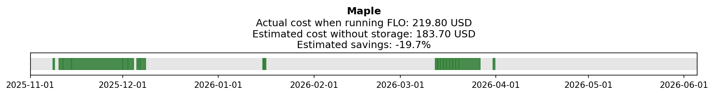
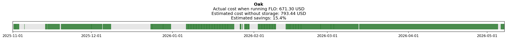

# FLO performance analysis

**Period:** November 1, 2025 – June 5, 2026

This note compares electricity spending under the Forward Looking Optimizer (FLO) against a baseline that represents what a homeowner would have paid without thermal storage or price-aware control. All cost totals below are summed over **hours when FLO was running**.

---

## Overview

Each hourly record includes heat pump electricity use, distribution energy, weather, and locational marginal price (LMP). We compute two costs for the FLO-active period:

| Metric | What it represents |
| --- | --- |
| **FLO cost** | Actual electricity bought to run the heat pump, priced at hourly LMP |
| **Baseline cost** | Estimated electricity that would have been needed to meet the same thermal load immediately, without storage or smart scheduling |

The timeline plots show when FLO was active (green) versus rule-based control (gray). The title reports both cost totals for that house.

---

## Methodology

### FLO electricity cost

For each hour when FLO is running:

$$
C^{\text{FLO}} = E^{\text{HP, el}} \cdot \text{LMP}
$$

where $E^{\text{HP, el}}$ is heat pump electricity use (kWh) and $\text{LMP}$ is the locational marginal price (USD/MWh).

The reported FLO total is $\sum C^{\text{FLO}}$ over FLO-active hours.

### Baseline electricity cost

The baseline estimates how much electricity the heat pump would have consumed in each hour if it had delivered the thermal load on demand, with no storage buffer and no price optimization. This requires hourly estimates of **load** and **COP**.

$$
C^{\text{base}} = \frac{L}{\text{COP}} \cdot \text{LMP}
$$

The reported baseline total is $\sum C^{\text{base}}$ over the same FLO-active hours.

#### COP model

COP is modeled as a linear function of outdoor air temperature (OAT), with a fixed value at very cold temperatures. Parameters are set per house.

$$
\text{COP} =
\begin{cases}
\text{COP}_{\min} & \text{if } \text{OAT} < T_{\min} \\
\beta_0 + \beta_{\text{oat}} \cdot \text{OAT} & \text{otherwise}
\end{cases}
$$

| Symbol | Meaning |
| --- | --- |
| $\beta_0$ | COP intercept |
| $\beta_{\text{oat}}$ | OAT coefficient |
| $\text{OAT}$ | Outdoor air temperature (°F) |
| $\text{COP}_{\min}$ | COP used below the cold-temperature threshold |
| $T_{\min}$ | OAT threshold (°F) below which COP is held constant |

#### Load model

Thermal load is estimated in two steps.

**Step 1 — Predict distribution energy from weather**

A linear regression is fit on all hours in the dataset (not only FLO-active hours) to predict hourly distribution energy from OAT and wind speed:

$$
\hat{D} = \alpha + \beta \, \text{OAT} + \gamma \, W \left(65 - \text{OAT}\right)
$$

where $W$ is wind speed (mph) and $\alpha$, $\beta$, and $\gamma$ are fitted from the data.

**Step 2 — Scale to total heat pump output**

The predicted distribution curve is scaled so its total matches the ratio between aggregate heat pump thermal output and aggregate measured distribution energy:

$$
L = \hat{D} \cdot \frac{\sum E^{\text{HP, th}}}{\sum D}
$$

where $E^{\text{HP, th}}$ is measured heat pump thermal output and $D$ is measured distribution energy. This scaling maps distribution-side load to the thermal output the heat pump would need to deliver in a no-storage scenario.

---

## Results

### Beech

### Elm

### Fir

### Maple

### Oak

